<div align="center">

**👋 Mohammad Hossein Mostafa**

[](https://github.com/mhmostafa505)
<br>

[](mailto:mhmostafa505@gmail.com)
[](https://t.me/ZonseWhakamateBegraben)
[](https://www.instagram.com/owuraka7600/)


</div>

<br>

<details open>
  <summary align="center">
      <samp>
        <b style="font-size: 15pt;">About Me</b>
      </samp>
  </summary>

  <br>

```javascript
const mohammad = {
  name: "Mohammad Hossein Mostafa",
  role: "Frontend Developer",
  coreStack: [
    "HTML",
    "CSS",
    "Tailwind CSS",
    "JavaScript",
    "TypeScript",
    "React",
  ],
  learning: ["Next.js", "MongoDB", "Docker"],
  nextGoal: "adding JavaScript-driven animations to my websites",
  funFact: needsCoffee() ? "☕ always" : "😴",
};

function needsCoffee() {
  return true;
}
```

<br>

- 🎨 Frontend Developer focused on building clean, responsive, user-friendly interfaces
- ⚛️ Core stack: **HTML, CSS, Tailwind CSS, JavaScript, TypeScript, React** (plus a few React libraries along the way)
- 🚀 Just picked up **Next.js** — still building my first project with it
- 🍃 Used **MongoDB** as the database in a Next.js course
- 🐳 Comfortable containerizing projects with **Docker**
- 🌱 Next up: learning to bring my websites to life with **JavaScript animations**
- 🤝 Open to collaborating on impactful, well-engineered projects

<br><br>

<h1 align="center">🛠️ Tech Stack</h1>

<div align="center">

**Languages & Frameworks**


**Styling**


**Database & Tools**


</div>

<br><br>

<h1 align="center">📊 GitHub Stats</h1>

<div align="center">


<br>

</div>

<br><br>

<h1 align="center">📌 Featured Projects</h1>

<div align="center">

[](https://github.com/mhmostafa505/Quera-Bootcamp-Project-02)
[](https://github.com/Soroush-Eghdami/Tweeter_Demo)

</div>

<br><br>

<h1 align="center">📫 Contact Me</h1>

```json
{
  "Email": "mhmostafa505@gmail.com",
  "Telegram": "@ZonseWhakamateBegraben",
  "Instagram": "@owuraka7600"
}
```

</details>

<br>

<div align="center"><i>Let's build something great together!</i></div>
